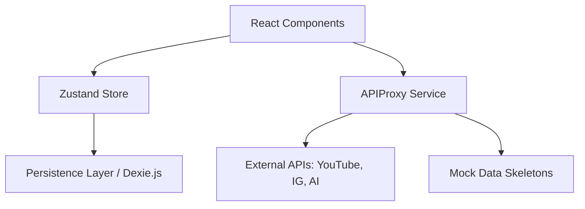

# Creator Command - System Architecture

This document describes the high-level architecture of the Creator Command platform, including state management, data flow, and external integrations.

## 1. Core Architecture Overview

Creator Command is built as a highly interactive, state-driven React application. It prioritizes offline-first reliability and AI-assisted productivity.

## 2. Component Design System

Components are designed using a "Liquid Glass" aesthetic, leaning heavily on:
- **Tailwind CSS**: For structural layouts and rapid UI iteration.
- **Framer Motion**: For smooth transitions, staggered entries, and micro-animations.
- **Lucide React**: For icon consistency.

### Key Shared Components:
- `Sidebar`: The main navigation shell.
- `Glass`: A high-blur backdrop component used for modals and overlays.
- `Card`: The base container for dashboard widgets.

## 3. State Management (Zustand)

The application uses a modular Zustand store located at `src/store/index.ts`. All interactive states are centralized here to ensure consistency across the dashboard.

### Store Slices:
- **Profile**: Creator name, handle, goals, and niche.
- **Integrations**: API keys (hidden by proxy) and sync status.
- **Content**: Tracks, project templates, and scheduled posts.
- **Analytics**: Trends, audience metrics, and financial CFO data.

## 4. API & Security Layer (`APIProxy.ts`)

The `APIProxyService` acts as a secure "Backend-on-the-Frontend".

### Responsibilities:
- **Credential Masking**: Prevents external libraries from accessing raw API keys via the `secureRequest` gate.
- **Rate Limiting**: Enforces a global request ceiling (50 req/min) to protect user tokens.
- **Caching**: Implements an LRU-style cache for AI prompts to prevent double-billing.
- **Mock Fallback**: Automatically returns realistic data structures if an API call fails or keys are missing.

## 5. Offline & Performance

- **Service Workers**: A native implementation in `public/sw.js` caches the shell assets (JS, CSS, HTML) and core icons.
- **Font Preloading**: `Plus Jakarta Sans` and `Space Mono` are pre-connected and pre-loaded in the HTML head to eliminate FOUT (Flash of Unstyled Text).
- **Zustand Persistence**: Integrated via `persist` middleware to save state to LocalStorage (migrating to Dexie.js for larger datasets).

## 6. Testing Strategy

- **Unit Testing**: Vitest handles core logic verification (entitlements, parsing, state transitions).
- **Interaction Testing**: `@testing-library/react` is used to simulate user workflows (e.g., `NicheFinder` quiz).
- **Mock Data**: `APIProxy` serves as the source of truth for all test data during development.

---
*Created on: 2026-03-29*
